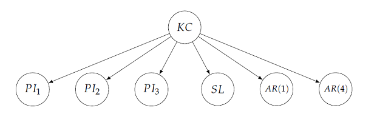

```{r, include = FALSE}
knitr::opts_chunk$set(
  collapse = TRUE,
  comment = "#>"
)
```

The **rPACI** package can read corneal topography files and then analyze them. This analysis includes the computation of some Placido irregularity indices. The indices computed by **rPACI** allow to discriminate between normal and irregular corneas. Most of them were introduced and validated with real datasets in the scientific publications @dramoslopez2011 and @dramoslopez2013. An additional index, based on a naive Bayes classifier, was proposed later, and tested with a different database, in @castroluna2020. In these papers, all indices demonstrated a good sensitivity for the detection of keratoconus, a corneal disease.

The purpose of this vignette is to explain the mathematical definition and the meaning of the indices given by **rPACI**. They can be split into two categories: primary and combined indices. The primary indices are: $PI_1$, $PI_2$, $PI_3$, $SL$, $AR_1$, $AR_2$, $AR_3$, $AR_4$, $AR_5$. They all measure certain geometrical properties of the data distribution. Based on them, other combined indices are computed: $GLPI$ (a generalized linear model) and $NBI$ (naive Bayes index).

## Data structure

First, we assume a `data.frame` with corneal data is already available, which may have been loaded from a file using the function `readFile` (see [Workflow of rPACI pacakge](packageUsage.html)), simulated using `simulateData` (see [Simulating corneal datasets](simulating.html)), or by other ways (as long as it meets the dataset requirements below).

The dataset consists of three columns: x, y (with the X and Y Cartesian coordinates of data points), and ring index (1, 2, ...). The number of rows (number of data points) in the dataset depends on the data availability (`readFile` by default only reads complete rings, and `simulateData` also simulates complete rings), and the chosen number of innermost rings to use (an optional parameter for `readFile`, 15 by default).

```{r, echo=FALSE, warning=FALSE}
  library(rPACI)
  # setwd(paste(dirname(rstudioapi::getActiveDocumentContext()$path),"/../R", sep=""))
  # source("simulateData.R")
  # source("indices.R")
  # source("plots.R")
  # source("readData.R")
  # source("wrapperFunctions.R")
```
```{r, eval=FALSE}
  dataset = simulateData(rings = 13)
  plot(dataset$x,dataset$y)
```
```{r, echo=FALSE}
  dataset = simulateData(rings = 13)
  par(mar=c(1.5,1.6,.1,.1), mgp=c(0,0.5,0))
  plot(dataset$x,dataset$y,pch=20,cex=0.3,cex.axis=0.5,asp=1, xlab="", ylab="") 
```

If $N$ is the number of complete rings to be used and $N_A$ is the number of points per ring (in the example, $N=13$ and $N_A=256$, its default value), the format in `dataset` is the following:

 x          | y           | ring index
-------     | -------     | ------- 
$x_1$       | $y_1$       | $1$ 
$x_2$       | $y_2$       | $1$
$x_3$       | $y_3$       | $1$
...         | ...         | ...
$x_{N_A}$   | $y_{N_A}$   | $1$
$x_{(N_A+1)}$ | $y_{(N_A+1)}$ | $2$
$x_{(N_A+2)}$ | $y_{(N_A+2)}$ | $2$
...         | ...         | ...
$x_{(2 N_A)}$ | $y_{(2 N_A)}$ | $2$
...         | ...         | ...
$x_{((N-1) \times N_A + 1)}$ | $y_{((N-1) \times N_A + 1)}$ | $N$
...         | ...         | ...
$x_{(N \times N_A)}$ | $y_{(N \times N_A)}$ | $N$

There are $N_A$ rows per ring ($N$ rings), and thus, a total of $N \times N_A$ data points (in the example, $N \times N_A = 13 \times 256 = 3328$). The dataset shall not contain missing data (this is guaranteed if using `readFile` with default parameters or `simulateData`).

Thus, we have $N \times N_A$ data points corresponding to $N$ complete rings, given in Cartesian coordinates. Let us define $R_k$, the set of points belonging to the $k$-th ring/mire (from the inside out) and $k \in \{1, \dots, N\}$ is the ring index. Then, a single data point $P_j=( x_j, y_j )$ (corresponding to the j-th row of the dataframe) belongs to $R_k$, i.e., $P_j \in R_k$ if $j \in J_k$, $J_k:=\{ n_k, n_k+1, ..., n_k+(N_A-1) \}$, with $n_k = 1+N_A(k-1)$ ($J_k$ is the set of indices $j$ which correspond to the $k$-th mire $R_k$, and $n_k$ is the first (smallest) of them).

## Primary indices

<!-- Several indices of corneal irregularity can be calculated from the raw measurements of a Placido disk corneal topographer (@dramoslopez2011, @dramoslopez2013). Many other similar indices exist -->

<!-- \citep{Alio2016, Prakash2012, Maeda1994, Rabinowitz1999, Issarti2019, Buehren2010}, --> 

<!-- but they cannot be computed using just the raw data of a Placido topographer, as they require besides altimetry, pachymetry, or curvature data, information about both surfaces of the cornea, or other parameters.  -->

<!-- The Placido indices or metrics based on the raw ring images have demonstrated their ability in diagnosing clinical diseases such as keratoconus and subclinical keratoconus, showing high accuracy (@dramoslopez2011, @dramoslopez2013, @castroluna2020). For the readers' convenience, a brief summary of those indices is reported below (more details and derivations can be found in those references). -->

The first step to calculate the indices is to compute the best-fitting circle (with center $C_k$ and (average) radius $AR_k$) for each ring, with $k \in \{1, \dots, N\}$. This is done by least-squares fitting of a general circle equation to the Cartesian coordinates of data points in ring $k$ and then, the geometrical parameters (center and radius) are computed from the coefficients (see @ahn2001 and @dramoslopez2011 for more details). These centers and radii contain information about the displacement or off-centering of the mires, as well as their size and regularity. A high level of drift or variability in these parameters is a signal of corneal irregularity (@dramoslopez2011).

From the best-fitting circle centers $C_k$, $k \in \{1, \dots, N\}$, a regression line can be adjusted to their coordinates ($y$ over $x$), yielding a slope $m$ and an intercept (which is not used). This line contains information about the direction of the displacement of the centers, which can be a signal of keratoconus (more specifically, the upper-bottom or north-south asymmetry is a marker for keratoconus, see @dramoslopez2013).

One can find also the best-fitting ellipses (with centers $\tilde{C}_k$ and axis ratio $c_k$, i.e., ratio or quotient between the major and the minor axis) for each ring ($k \in \{1, \dots, N\}$). This process is also based on a least-squares fit of the general ellipse equation to the Cartesian coordinates of data points of mire $k$ (see @ahn2001 and @dramoslopez2011 for more details). A high level of variability in the axis ratio is also a signal of corneal irregularity (@dramoslopez2011).

Using the quantities, we can define four corneal irregularity indices, labeled as $PI_1, PI_2, PI_3$ (from *Placido Irregularity indices*) and $SL$^[The index $SL$ (introduced in @dramoslopez2013) is not called $PI_4$ to prevent misunderstandings, since an index of that name was previously defined in @dramoslopez2011]:

* $PI_1$ 
$$ PI_1  = \frac{1}{N} \max_{1 \leq n,m \leq N}{ \|C_n - C_m \| } $$
This index measures the diameter of the set of centers $C_k$ (normalized by the total number of rings $N$), where $\| \cdot \|$ is the standard Euclidean norm in $\mathbb R^2$. A high value of this index shows a large displacement or off-centering between the mires.

* $PI_2$ 
$$ PI_2 = \frac{1}{N-1} \sum_{1 \leq n \leq N-1}{ \|C_{n+1} - C_{n} \| } $$
corresponds to the total length of the path connecting consecutive centers. $PI_2$ measures the accumulated drift between each pair of mires. In some cases, $PI_1$ (diameter) can be relatively small but the centers drift a lot from a mire to the next. $PI_2$ is able to capture this kind of irregularity, which is an abnormal sign.

* $PI_3$
$$ PI_3   =   \sqrt{ \frac{1}{N} \sum_{1 \leq k \leq N} { (c_k - \overline{c})^2 } }, \quad \text{where} \quad  \overline{c}=\frac{1}{N} \sum_{1 \leq k \leq N}  c_k $$
is the standard deviation of the distribution of axis ratios, so that it measures the variability of the axis ratios or eccentricities of the individual rings. A large value of $PI_3$ indicates a high variability in the shapes of the rings, and thus it is a signal of irregularity.

* $SL$ 
$$ SL = |m| $$
is the absolute value of the slope of the best-fitting line to the coordinates of the centers $C_k$. High values of this index correspond to vertical mire displacements whereas low values correspond to horizontal displacements.

Apart from these 4 indices, we also take as irregularity indices the values of $AR_k$ (average radius of the $k$-th ring) corresponding to the first (innermost) 5 rings. These values also showed a certain sensitivity for detecting keratoconus (@dramoslopez2011).


### Normalization of the primary indices

In order to obtain indices with values in the same range (more easily comparable and to prevent scale problems when combining them), a normalization of each primary index was performed (@dramoslopez2011 and @dramoslopez2013). To do it, these indices were tested on a real dataset of corneas of different conditions. Then, their values were linearly translated to $[0,100]$, so that the value corresponding to the best possible condition (less irregularity) was transformed to $0$, and the worst (more irregularity) to $100$. Therefore, in the test dataset, the values of all primary indices were between $0$ (best-case) and $100$ (worst-case). 

In practice, after the transformation, most index values for any cornea will be in $[0,100]$, but in some particular cases, they may be outside that interval. To facilitate their interpretation, we can assume that values below zero correspond to zero, and the maximum irregularity is attained at a certain value (e.g. 150, this value is discussed in @dramoslopez2011).

The normalization coefficients used in the previous studies (@dramoslopez2011 and @dramoslopez2013) were the following (for notation simplicity, values on the left-hand side of the expressions represent normalized values whereas values on the right-hand side are values before the normalization (as computed by their definitions above)):

$$ PI_1 = 12368.3980719706  PI_1 - 12.5200561911951 $$ 
$$ PI_2 = 9699.23915314471 PI_2 - 18.2916611541283$$ 
$$ PI_3 = 5233.70399537826 PI_3 - 13.7375152045819$$ 
$$ SL = 50 SL$$ 
  
$$ AR_1 = -1961.92346976023 AR_1 + 444.770836424576 $$
$$ AR_2 = -562.8465909984122 AR_2 + 279.7430721547980 $$
$$ AR_3 = -486.9218093835968 AR_3 + 331.3137688964757 $$
$$ AR_4 = -318.192614292727 AR_4 + 298.064078007947 $$
$$ AR_5 = -288.4037960143595 AR_5 + 321.4180137915255 $$

Thus, after the normalization (and possible truncation of extremely high or low values), all indices values lay in $[0,150]$, with $0$ corresponding to the most normal case and $150$ to the most irregular case. This value of $150$ is arbitrary and could be changed (increased or lowered), but we found it performed well in practice (@dramoslopez2011 and @dramoslopez2013).

## Combined indices

The primary Placido indices described above, $PI_1$, $PI_2$, $PI_3$, $SL$, and $AR_k$, show sensitivity to detecting various irregularities in the cornea, such as keratoconus (@dramoslopez2011, @dramoslopez2013). However, a single index does not reach sufficient accuracy in the task, and compound indices have been proposed and tested (@dramoslopez2013, @castroluna2020) in order to improve the performance and precision of the individual indices. These compound indices showed a significant improvement in accuracy when predicting keratoconus. 

A brief description of them is given as follows (see the aforementioned references for more details):

### GLPI index 

The $GLPI$ index (from Generalized Linear Placido Index) (@dramoslopez2013) is a generalized linear model computed using some of the primary indices, in the following way:
$$ GLPI = 100 \Phi \left( \left(-224.90 + 1.69 PI_1 + 1.28 PI_3 + 1.89 AR(4) + 0.19 SL \right)/20 \right) $$

where $\Phi$ stands for the cumulative distribution function of the standard normal distribution. This corresponds to a generalized linear regression model with the *probit* ($\Phi^{-1}$) link function. Therefore, $GLPI$ has values between $0$ and $100$. The coefficients in the formula above were obtained by fitting a real-world dataset of normal and keratoconic corneas (@dramoslopez2013). The index $GLPI$ was validated giving an excellent discrimination capability of irregular corneas.

### NBI index 

The compound index $NBI$ (from Naive Bayes Index), introduced in @castroluna2020, is a Bayesian classifier. More precisely, it is a Bayesian network with the naïve Bayes structure depicted below.



This Bayesian network is a conditional linear Gaussian (CLG) network, with its root node ($KC$) being a discrete binary variable and the rest of the nodes (which are some of the primary indices introduced above) being continuous. The parameters of the model (their conditional probability distributions) were reported in @castroluna2020. This model can be used for predicting whether a specific cornea (whose values of the primary indices are known) is a normal cornea or a keratoconic cornea. 

Moreover, the probability of being one type or another can be computed as well, either using exact inference or approximate inference with algorithms such as evidence weighting, likelihood weighting, or more generally, importance sampling (@cheng2000). Even though exact inference is feasible in this case, approximate inference is easier to implement and to generalize to more complex network structures. In a nutshell, these algorithms consist of simulating a large number of samples from the network, according to the evidence (i.e., variable values that are known a priori), and averaging their likelihoods to estimate the probability of each state of the target variable (in this case, $KC$). For a deeper explanation, we refer the readers to @castroluna2020 and its references.

Thus, the posterior probability estimation can be computed efficiently with several approaches. In **rPACI**, we make use of the R package [**bnlearn**](https://cran.r-project.org/package=bnlearn)  (@scutari2010), which includes an implementation of the likelihood weighting algorithm, for computing the index NBI from the primary indices values of the bottom nodes.

## References

