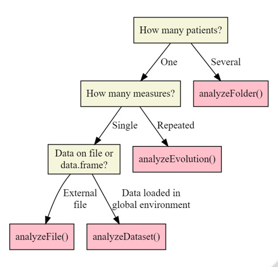

```{r setup, include = FALSE}
knitr::opts_chunk$set(
  collapse = TRUE,
  comment = "#>"
)
```

The **rPACI** package is developed to facilitate the calculation and interpretation of several indices for detecting corneal irregularities, and especially keratoconus. These indices were introduced in @dramoslopez2011, @dramoslopez2013 and @castroluna2020, and proved to be effective in detecting keratoconus and early keratoconus.

## Package installation
**rPACI** depends on the **bnlearn** package and uses functions from the **ggplot2**, **tidyr** and **ggpubr** packages as well.
To install and load the package and its dependencies, open an R session and write the following code:

```{r, eval = F}
install.packages("rPACI", dependencies = TRUE)
library("rPACI")
```
```{r, echo = F, warning = F, message=F}
library("rPACI")
```

## Available datasets
The **rPACI** package contains 11 datasets, real and simulated, with two different formats.

File name | Source | File format | Directory | Corneal condition
-------   | ------- | -------  | ------- | ------- 
ds1.txt   | Real measurement| rPACI | system.file("extdata", package="rPACI") | Normal
ds2.txt   | Simulated data | rPACI | system.file("extdata", package="rPACI") | Normal
K01.txt | Real measurement | CSO | system.file("extdata", package="rPACI") | Keratoconus
K02.txt | Real measurement | CSO | system.file("extdata", package="rPACI") | Keratoconus
K03.txt | Real measurement | CSO | system.file("extdata", package="rPACI") | Keratoconus
N01.txt | Real measurement | CSO | system.file("extdata", package="rPACI") | Normal
N02.txt | Real measurement | CSO | system.file("extdata", package="rPACI") | Normal
S01.txt | Real measurement | CSO | system.file("extdata", package="rPACI") | Keratoconus suspect
simulated_2020_05_31.txt | Simulated data | rPACI| system.file("extdata/evolution/", package="rPACI") | Normal
simulated_2020_10_31.txt | Simulated data | rPACI | system.file("extdata/evolution/", package="rPACI") | Keratoconus suspect
simulated_2021_04_30.txt | Simulated data | rPACI | system.file("extdata/evolution/", package="rPACI") | Normal

## Reading data
The package includes three functions to read data: `readCSO()`, `readrPACI()` and `readFile()`. The two former ones read data in specific formats (explained below), while the latter one is a wrapper function able to read both formats. In general, we recommend using the more general wrapper function `readFile()` to read any file format.

### readCSO()
To begin with, external files with a corneal topography in the format exported by some Placido disk topographers, especially those from CSO (a commercial brand), can be loaded using the function `readCSO()`. We recommend reading the [Corneal topographers and data format](topographersDataFormat.html) vignette. 
This reading function allows to specify different parameters: 
<!-- the amount of rings available (`ringsTotal`), the number of points per ring (`pointsPerRings`), and rings to use (`ringsToUse`), whether to use or not only complete rings (`onlyCompleteRings`), and the value(s) encoding NAs (missing data) in the file (`NAvalues`).  -->
<!-- In the following example, a sample file with the corneal topography of a normal eye (included in the package as `N01.txt`) is used: -->

* `filepath`: The name of the file to be read.
* `ringsTotal`: The total (maximum) number of rings that may be available in the measurement (including incomplete rings or missing data; it depends on the particular device; by default 24).
* `pointsPerRings`: The number of points per ring that are digitized in the measurement (it depends on the particular device; by default 256).
* `ringsToUse`: The effective number of innermost rings to use (as long as they are complete if `onlyCompleteRings = TRUE`, otherwise it will be the actual number of complete rings; by default 15).
* `onlyCompleteRings`: A boolean value indicating whether to use only rings with complete data or not (by default, TRUE).
* `NAvalues`: A numerical value or vector indicating how NA values are codified in the file (by default c(-1, -1000)).

In the following example, a sample file with the corneal topography of a normal eye (included in the package as `N01.txt`) is used:
<!-- In order to begin with the analysis, the data exported by [some commercial Placido disk topographer](topographersDataFormat.html) can be loaded using the function `readCSO()`. In this example, a sample file with the corneal topography of a normal eye (included in the package as `N01.txt`) is used: -->

```{r, eval = T}
dataset1 = readCSO(filepath = system.file("extdata","N01.txt", package="rPACI"))
```
<!-- This function returns a `data.frame` [conveniently formatted](indicesDefinition.html) to be used in the next step of the analysis. -->

This function produces a `data.frame` in the usual format used by `rPACI`, i.e., a data frame with three columns (x and y coordinates of each point and its ring index) and a row per data point, according to the function parameters (by default, 24*256 = 6144 rows or data points).

```{r, eval = T}
head(dataset1)
```

### readrPACI()
On the other hand, external files with a corneal topography in the format exported by rPACI can also be loaded using the function `readrPACI()`. This function has two arguments: the path to the file (`filepath`) and the character used as column separator in the file (`sep`). 
In the following example, a sample file with the rPACI format (included in the package) is loaded: 

```{r, eval = F}
dataset2 = readrPACI(filepath = system.file("extdata","ds1.txt", package="rPACI"))
```

This function returns a `data.frame` with the same characteristics as `readCSO()`.

### readFile()
Finally, the general wrapper function `readFile()` can be used to read any of the aforementioned file formats. Internally, it determines the format of the specified file and applies either `readCSO()` or `readrPACI()` if possible, or else it throws an error (if none can be applied, which occurs when the file format does not fit any of these two available formats). This is the reading function recommended by default, as it is able to read any supported file format.
The `readFile()` function takes the file path as a mandatory argument and, optionally, any of the arguments available for the other two reading functions. As a result, this function creates a `data.frame` in the usual format used by `rPACI`, as the other two functions do.
In the following example, a sample file included in the package is loaded using the `readFile()` wapper function:
```{r, eval = T}
dataset3 = readFile(filepath = system.file("extdata","N01.txt", package="rPACI"))

head(dataset3)
```

## Saving data
The function `writerPACI()` writes to disk a corneal topography dataset in the format used by `rPACI`. The file will be saved in structured plain text, which will possibly have
a header, followed by a block of three separated columns, according to the usual format used by `rPACI`,
i.e., a list with three columns (x and y coordinates of each point, and its ring index) and a row per data point.

If the given `data.frame` (named `dataset`) was produced using the function `simulateData()`, the resulting
text file will also include the `Parameters` attribute (`attr(dataset,'Parameters')`) in its header,
i.e., the list of parameters used for the simulation.

A file stored with `writerPACI()` can later be read using the general reader function `readFile()`
or the specific reader function `readrPACI()`.

The following piece of code shows how to use the `writerPACI()` function. 

````{r, eval = F}
# Simulating an elliptic dataset, with ellipses axis ratio of 0.8 and an orientation of 45 degrees.
dataset = simulateData(rings = 18, pointsPerRing = 300, ellipticAxesRatio = 0.8, ellipticRotation = 45)

# Now the dataset can be saved to file using 'writerPACI' (check the working directory before saving):
writerPACI(dataset, "datasetFile.txt")
````

See more details about the file structure in the [Corneal topographers and data format](topographersDataFormat.html) vignette and about simulation parameters in the [Simulating corneal datasets](simulating.html) vignette. 

## Computing the Placido irregularity indices
When a corneal dataframe is available in the global environment, the [Placido irregularity indices](indicesDefinition.html) of this data set can be computed by calling function `computePlacidoIndices()`, which takes the object returned by `readFile()` (or `readCSO()` or `readrPACI()`) as its only argument:

<!-- We can now compute the [Placido irregularity indices](indicesDefinition.html) of this data set by calling function `computePlacidoIndices()`, which takes the object returned by `readCSO()` as its only argument: -->
<!-- (see this [vignette](indicesDefinition.html) for a detailed definition of the indices) -->

```{r, eval = T}
results_N = computePlacidoIndices(dataset1)
results_N
```

The object returned by `computePlacidoIndices()` is of class `data.frame` and contains 12 columns and 1 row (because we are analyzing only one eye).
The first column of the returned `data.frame` is the diagnosis, based on the GLPI index, which can be either `Irregular cornea` (GLPI $\geq$ 70), `Suspect cornea` (30 $\leq$ GLPI <70) or `Normal cornea` (GLPI <30). The next column is the Naive Bayes Index (NBI), which ranges between 0 and 100 and can be interpreted as the probability of suffering from keratoconus. The remaining columns correspond to the primary indices, defined in the [Mathematical definition of the indices](indicesDefinition.html) vignette.
<!-- (see definitions in the previous sections). -->

## Plotting the results
The results of the previous analysis can be plotted using function `plotSingleCornea()`, which takes 3 arguments: `dataset`, a `data.frame` containing the corneal topography data, i.e., the object returned by `readFile()` (or `readCSO()` or `readrPACI()`); `PlacidoIndices`, a `data.frame` containing the computed Placido indices, i.e., the object returned by `computePlacidoIndices()`; and, optionally, `filename`, a character vector to be displayed on the plot (for instance, the filename of the corneal topography dataset).


```{r, eval = T, fig.width = 7, fig.height = 4}
  plotSingleCornea(dataset1, results_N, filename = "N01.txt")
```

The left-hand side of the figure shows the input data, whereas the right-hand side shows two charts: the GLPI index plot, which visually indicates the value taken by this index on a colored scale of possible values, and the PI indices distribution, which shows the distribution of the $PI_1$, $PI_2$, $PI_3$ and $SL$ indices in a boxplot placed on a scale of possible values. The colors of the charts indicate whether the indices fall within the *normal cornea* region (green color), *suspicious cornea* region (orange color), or *irregular cornea* region (red color). In the example shown, we can clearly see that the eye is diagnosed as normal.

## Using the wrapper function to analyze one external file
Alternatively to use the `readFile()`, `computePlacidoIndices()` and `plotSingleCornea()` functions, the wrapper function `analyzeFile()` can be used instead, which takes 2 arguments: `path`, which is a character string indicating the location of the corneal topography file, and `drawplot`, which is a logical argument indicating whether the results should be plotted or not.
This function returns a `data.frame` containing the same information as the object returned by `computePlacidoIndices()` and, optionally, the plot returned by `plotSingleCornea()` if the argument 
`drawplot` is `TRUE`. 

```{r, eval = T, fig.width = 7, fig.height = 4}
  res_K = analyzeFile(system.file("extdata","K01.txt", package="rPACI"), drawplot=TRUE)
  res_K
```


In this example, the results indicate that the patient's cornea is irregular. In this case, the plot shows a GLPI index of 100 and a distribution of PI indices ranging from 100 to 130.

## Using the wrapper function to analyze one dataset
The function `analyzeFile()` reads a file stored in our computer. But, what if we already have a corneal data frame loaded in our global environment? We can use the wrapper function `analyzeDataset()` instead. This function is a wrapper of `computePlacidoIndices()` and `plotSingleCornea()`, so that it returns the same objects as `analyzeFile()`. This is a convenient function, for instance, when we use the `simulateData()` function (for more details on this function, see the [Simulating corneal datasets](simulating.html) vignette) or have previously loaded the data using the `readFile()` function.

`analyzeDataset()` takes two arguments: `dataset`, which is a corneal topography dataset in the format supported by **rPACI**; and `drawplot`, which is an optional logical parameter indicating whether a plot of results should be displayed or not (by default, TRUE).

```{r, eval = T, fig.width = 7, fig.height = 4}
# Generate a sample dataset
dataset = simulateData(rings = 12, maximumMireDisplacement = 0.2, mireDisplacementAngle = 50)

# Analyze the datatset
res_dataset = analyzeDataset(dataset = dataset)
res_dataset
```

## Analyzing multiple patients simultaneously

So far, `analyzeFile()` and `analyzeDataset()` can only be used to analyze one dataset (i.e., one patient's eye) at a time. In order to analyze multiple files simultaneously, the function `analyzeFolder()` can be used. This function takes 4 arguments: `path`, to indicate the location of the folder containing the files; `fileExtension`, which indicates the extension of the files, is set to 'txt' by default; `individualPlots`, which is an optional logical argument indicating whether the plot for each file should be displayed or not; and `summaryPlot`, which is an optional logical argument indicating whether a summary plot of all files analyzed should be displayed or not. If the argument `summaryPlot()` is `TRUE`, then a barplot showing the absolute frequency of each possible value of diagnosis is depicted.

```{r, eval = T, fig.width = 7, fig.height = 4}
resultsAll = analyzeFolder(path = system.file("extdata", package="rPACI"), individualPlots = T, summaryPlot = T)  
resultsAll
```

This function returns a `data.frame` containing 13 columns and as many rows as files analyzed. The first 12 columns correspond to the diagnosis and the indices, as in the object returned by `computePlacidoIndices()`. The last column corresponds to the file name so that a specific patient can be easily found. To see the diagnosis for each analyzed file, the first and last columns can be selected:
```{r, eval = T}
resultsAll[,c(13,1)]
```
Note that the rows are sorted from *Irregular* to *Normal* cornea. In this example, three eyes are diagnosed as *irregular*, one as *suspect*, and four as *normal*. This is an easy and straightforward way to check if any patient potentially suffers from keratoconus.


## Analyzing one patient over time
In order to examine the evolution of a patient's eye over time, the function `analyzeEvolution()` can be used. This function takes two arguments: `data`, which can be either 1) the path of a folder that contains corneal topography files, with format supported by **rPACI**, or 2) a list containing properly formatted data (loaded from a file using the function `readFile()` (or `readCSO()` or `readrPACI()`), simulated using `simulateData()`, or by other ways, as long as it meets the dataset requirements). If `data` is a path to a folder, the second argument, `fileExtension`, must be specified and all the files (with the given extension) in that folder will be assumed to be corneal topography files of a patient's eye and, therefore, will be loaded.

Moreover, it will be assumed that the temporal arrangement is the alphabetical order of the filenames. 
Therefore, it is advised to use a proper file name, for instance using this date format: 'YYYY-MM-DD.txt'.
On the other hand, if the data are stored in a list, it will be assumed that the temporal order corresponds with the index of each dataset in the list.

The next example simulates three patient's measurements over time using the function `simulateData()` and then analyzes these files:
````{r, eval = F, fig.width = 7, fig.height = 4}
# Simulate the patient's measures over time
 dataT1 = simulateData(rings = 12, maximumMireDisplacement = 0.15, mireDisplacementAngle = 10)
 dataT2 = simulateData(rings = 12, maximumMireDisplacement = 0.15, mireDisplacementAngle = 45)
 dataT3 = simulateData(rings = 12, maximumMireDisplacement = 0.2, mireDisplacementAngle = 50)

# Create a list containing the data
data = list(
 dataT1 = dataT1,
 dataT2 = dataT2,
 dataT3 = dataT3
)

# Analyze the data over time
analyzeEvolution(data = data)
````

This other example imports the corneal data from disk and analyzes the files:

````{r, eval = T, fig.width = 7, fig.height = 4}
# Specify a folder path to analyze a patient's evolution over time
analyzeEvolution(data = system.file("extdata/evolution/", package="rPACI"), fileExtension = 'txt')

````

The `analyzeEvolution()` function returns a `data.frame` containing 13 columns and as many rows as files analyzed. The first 12 columns correspond to the diagnosis and the indices, as in the object returned by `computePlacidoIndices()`. The last column corresponds to the time step at which the measures were taken. 
Moreover, two temporal plots are returned. The left-hand side plot shows the $GLPI$ index, represented by a red line, and the boxplots of the primary indices $PI_1$, $PI_2$, $PI_3$, and $SL$ over time. The right-hand side plot shows the times series of these five indices, $GLPI$, $PI_1$, $PI_2$, $PI_3$, and $SL$, individually. Finally, both plots present a colored background, corresponding with the final diagnosis of the patient. 

In this example, the results indicate that the patient's cornea was normal at time 1, suspected at time 2, and irregular at time 3.

## Summary
To summarize, the following description chart can help decide which function to use depending on the specific case to analyze. 



````{R, echo = F, eval = F, fig.width = 4, fig.height = 4}
# library(DiagrammeR)
# DiagrammeR::grViz("digraph {
# 
# graph [layout = dot]
# 
# # define the global styles of the nodes. We can override these in box if we wish
# node [shape = rounded, style = filled, fillcolor = Pink]
# 
# step1 [label = 'How many patients?', fillcolor = Beige]
# step2 [label = 'How many measures?', fillcolor = Beige]
# step3 [label =  'Data on file or \n data.frame?', fillcolor = Beige]
# leaf1 [label = 'analyzeFile()']
# leaf2 [label= 'analyzeDataset()']
# leaf3 [label = 'analyzeEvolution()']
# leaf4 [label = 'analyzeFolder()']
# 
# 
# # edge definitions with the node IDs
# step1 -> step2 [label='One']
# step1 -> leaf4 [label='Several']
# step2 -> step3 [label='Single']
# step2 -> leaf3 [label='Repeated']
# step3 -> leaf2 [label='Data loaded in \nglobal environment']
# step3 -> leaf1 [label='External \nfile']
# }")
````

## References